# [PYTHON] ASCII generator

## Introduction

Here is my python source code for ASCII generator. With my code: 
* **Given input image, we could generate ASCII art stored under text format in different languages (.txt)**
* **Given input image, we could generate ASCII art stored under image formats in different languages (.png, .jpg, ...). In each format, there are 2 options: Black background and white characters, or vice versa**
* **Given input video, we could generate ASCII art stored under video formats in different languages (.avi, .mp4, ...)**
* **Video/image outputs could be in grayscale or color format. It is totally up to you**

## Multiple Language Conversion
We could generate ASCII art with different alphabets (english, german, french, korean, chinese, japanese, ...). Below are example output:

  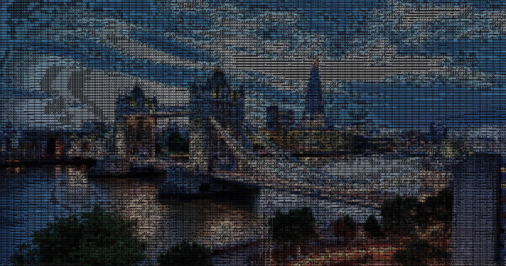 
  <i>English</i>

  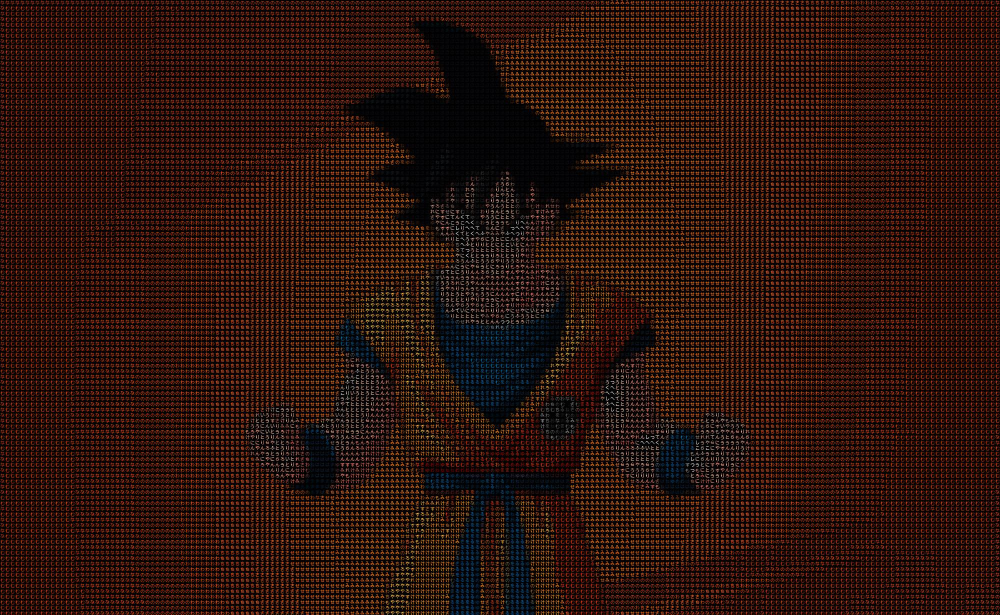 
  <i>Japanese (Dragon Ball)</i>

  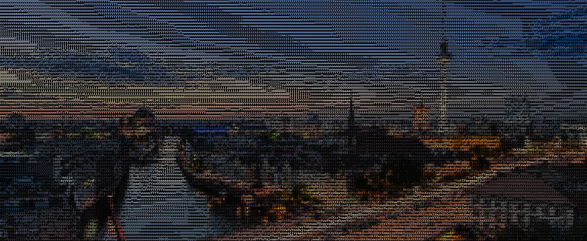 
  <i>German</i>

  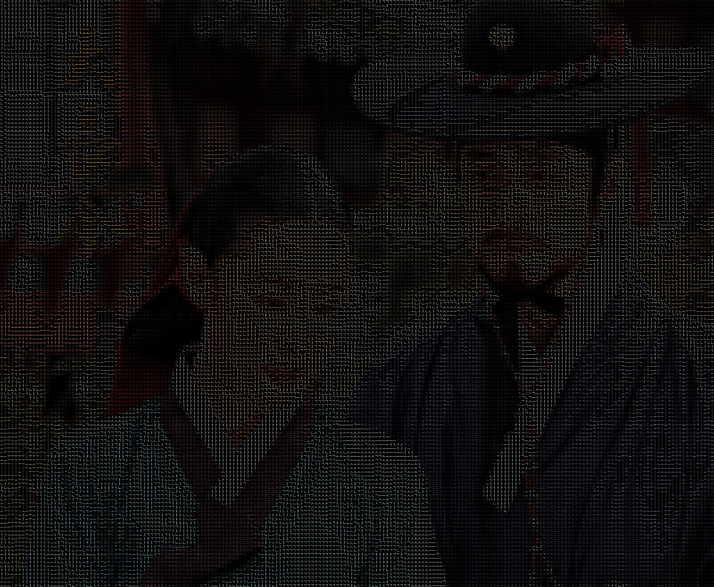 
  <i>Korean (Dae Jang-geum)</i>

  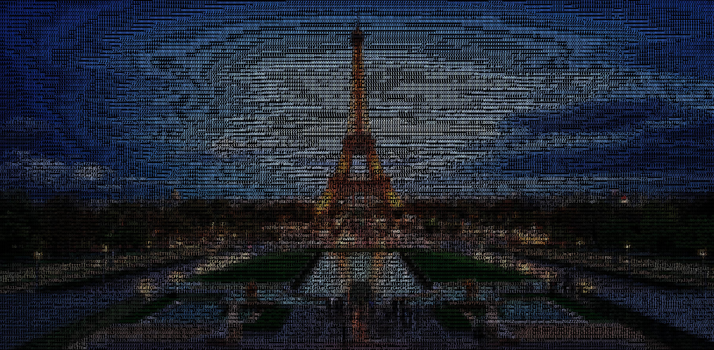 
  <i>French</i>

  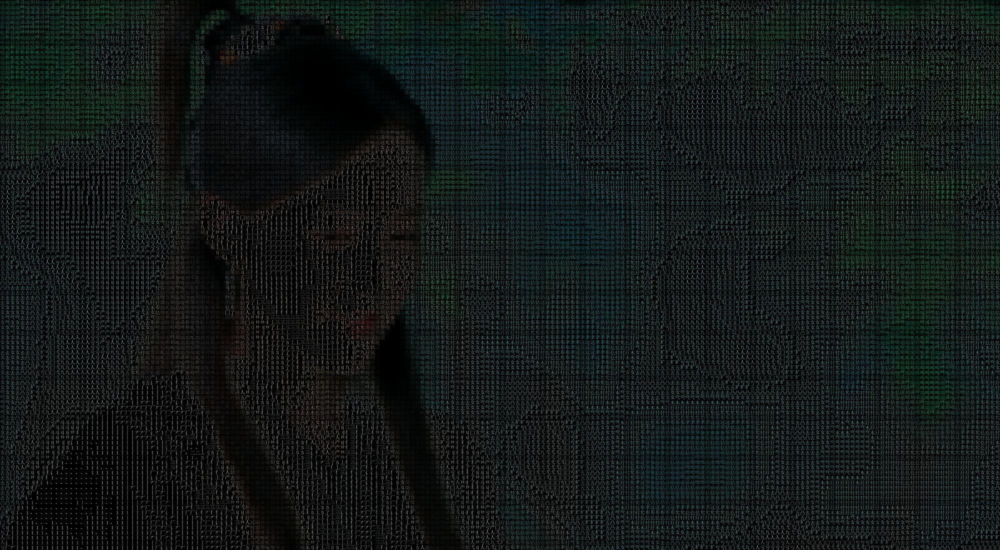 
  <i>Chinese (Actress)</i>

  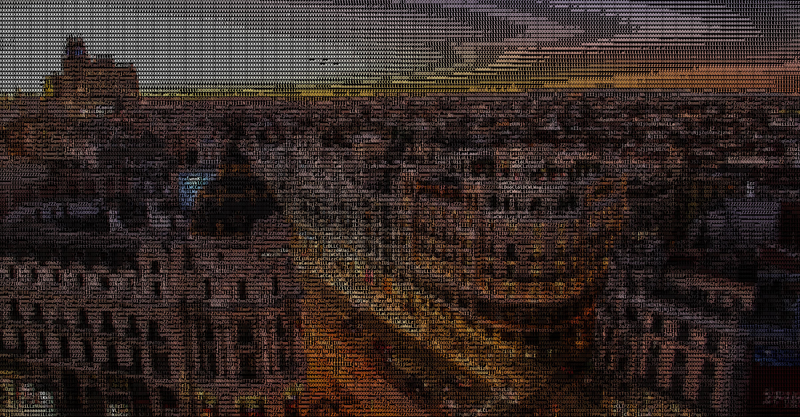 
  <i>Spanish</i>

  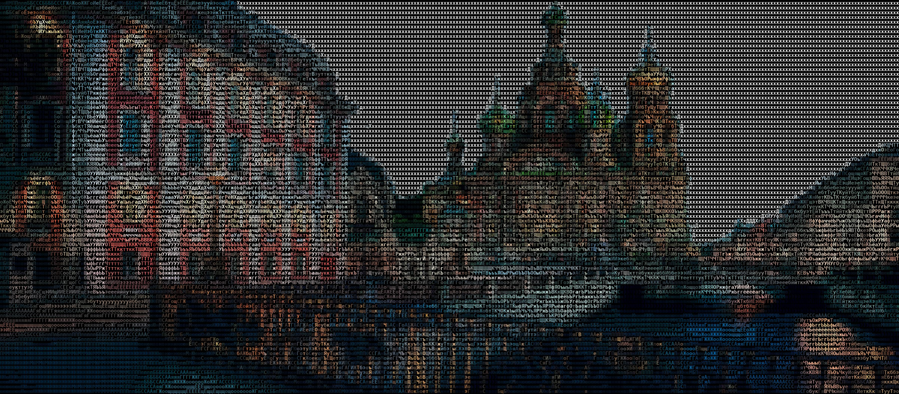 
  <i>Russian</i>

## Video to video
By running the sript **video2video_color.py** or **video2video.py** with different values for *background* and *mode*, we will have different outputs, for example:

   
  <i>Colored complex-character ASCII output</i>

   
  <i>White-background simple-character ASCII output</i>

## Image to text
By running the sript **img2txt.py** with different values for *mode*, we will have following outputs:

   
  <i>Input image</i>

  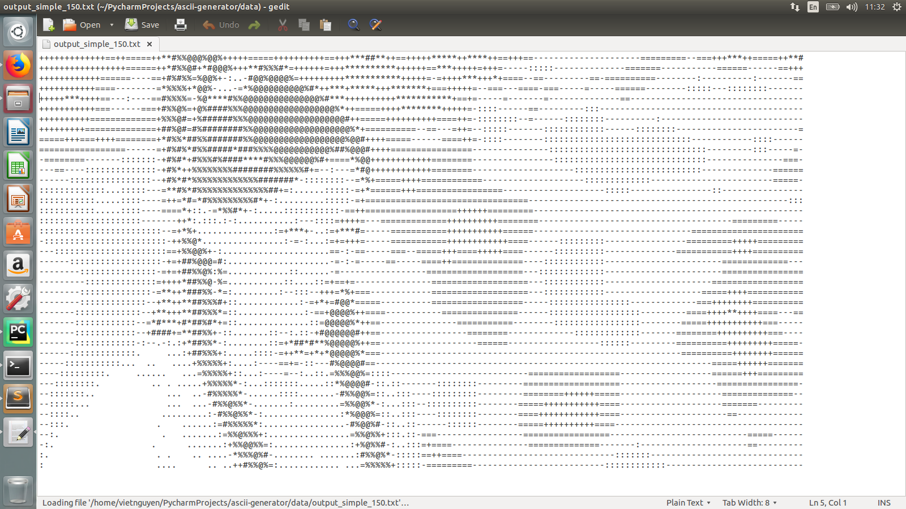 
  <i>Simple character ASCII output</i>

  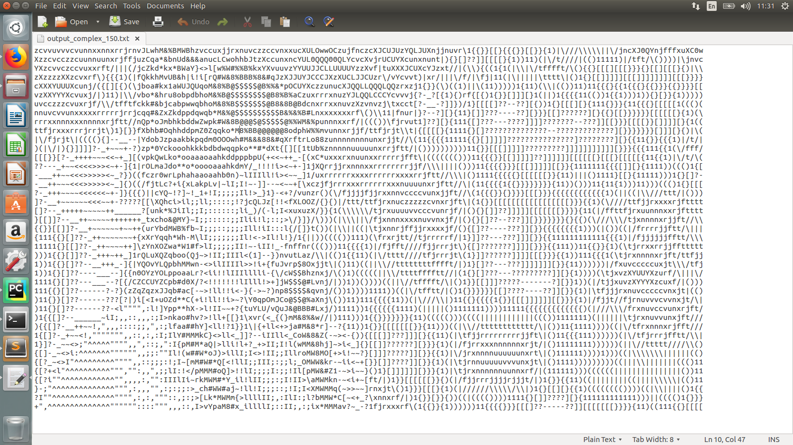 
  <i>Complex character ASCII output</i>

## Image to image
By running the sript **img2img_color.py** or **img2img.py** with different values for *background* and *mode*, we will have following outputs:

   
  <i>Input image</i>

  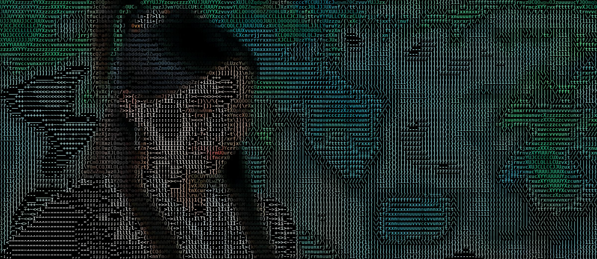 
  <i>Colored complex-character ASCII output</i>

   
  <i>White-background simple-character ASCII output</i>

  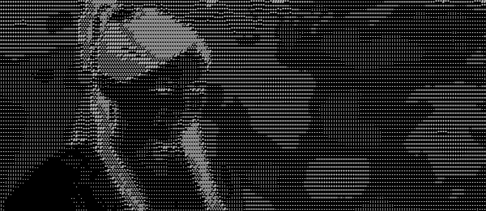 
  <i>Black-background simple-character ASCII output</i>

  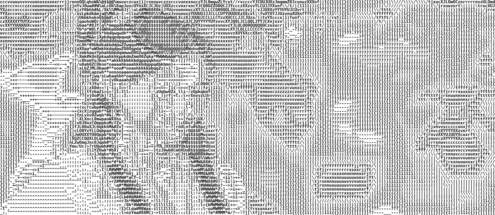 
  <i>White-background complex-character ASCII output</i>

   
  <i>Black-background complex-character ASCII output</i>

## Requirements

* **python 3.6**
* **cv2**
* **PIL** 
* **numpy**
